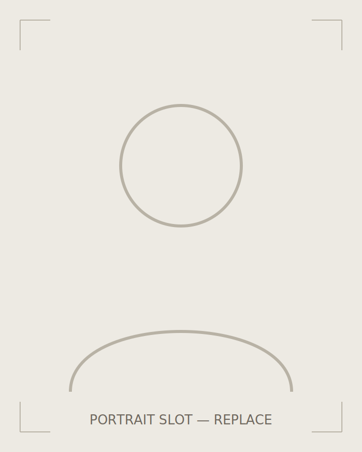

I'm Eric — a computer engineering student in Washington. The through-line
in everything I make is wanting to know what's actually happening one
layer down: what the compiler emitted, why the print warped, where the
light went.

I keep a small fleet of ongoing builds — a discrete-logic CPU, a receipt
printer that answers to the local network, a drawer of 3D-printed tools
that each replaced something I almost bought. I photograph and film the
process, partly to share it and partly because a camera is a merciless
reviewer: it finds every cold joint and every sloppy chamfer.

Good objects matter to me — the kind with provenance, where you can tell
someone chose the stitch density or the switch weight on purpose. This
site is my attempt to hold web pages to the same standard.

## Toolbox

| Domain | Daily drivers |
| ------ | ------------- |
| Embedded | C/C++, ESP32, AVR, PlatformIO, saleae + scope |
| Fabrication | Fusion 360, FDM printers, deburring tool I'd rescue from a fire |
| Camera | Sony bodies, speedlights, DIY modifiers, Premiere |
| Web | TypeScript, Astro, CSS written by hand |

## Now

- Studying computer engineering
- Writing up the backlog of builds, one post at a time
- Trying to keep the parts bins under 100% capacity (failing)

## Papers & links

[Résumé (PDF)](/resume.pdf) — placeholder until the real one lands.
Find me on [GitHub](https://github.com/AWSOMEDUDE00000090) or say hi at
[eluo2007@gmail.com](mailto:eluo2007@gmail.com).
